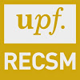

## RonR! First Seminar Series

The RonR! Seminar Series is an interactive R course aimed at students who want to learn R. They were first created as a set of exercises for a series of lectures given in April-May 2016 in Pompeu Fabra University. These exercises have evolved to stand on their own and can now be accessed by following the tutorial [here](https://github.com/cimentadaj/Rseminars/tree/master/RonR_Second_Seminar).

**Seminar 1. An overview of the strengths of R**

*Note: This introduction does not contain exercises, only an [RMarkdown presentation](https://github.com/cimentadaj/Rseminars/blob/master/RonR_First_Seminar/First-seminar-presentation.rmd)*

Instructor: [Jorge Cimentada](http://www.jorgecimentada.com)

Brief introduction to R

* First steps using R
  + The webpage of the R project
  + Installation of R
* R environment
  + Contributed packages and their installation
  + How to work with R: Workspaces and scripts
* R graphics
  + Graphs (ggvis, ggplot2)
  + Interactive graphs(ggvis, plotly, shiny, Rcharts)
  + Maps
* R and statistics
  + Summary statistics output(stargazer package)
  + Regression output(stargazer package)
* R for reports and teaching
  + Making reports, PDF’s and powerpoints through R (RMarkdown package)
  + Programming exercises and exams in R (swirl and exam package)

## **Seminar 2. Getting familiar with R objects**

This seminar contains exercises [here](https://github.com/cimentadaj/Rseminars/tree/master/RonR_Second_Seminar).

Instructors: [Basilio Moreno](https://www.linkedin.com/in/basiliomp) and [Jorge Cimentada](https://cimentadaj.github.io/)

* Basic objects: Vectors
  + Numerical, logical and character vectors
  + Generation of regular sequences
  + Vector arithmetic
  + Matrices and lists

* Basic objects: Matrices and lists
  + Creation and modification of matrices
  + Creation and modification of lists
  + Subsetting matrices and lists

* Basic objects: Data frames (I)
  + Creation of data frames
  + Adding new variables
  + Subsetting data frames

* Basic objects: Data frames (II)
  + Working with data frames: Functions attach and with
  + Merging data frames
  + Labelling variables

## **Seminar 3. Manipulating and processing data**

This seminar contains exercises [here](https://github.com/cimentadaj/Rseminars/tree/master/RonR_Third_Seminar)

Instructor: [Daniel Ciganda](dciganda@gmail.com)

* Importing data from SPSS, EXCEL and STATA
* Basic data manipulation:
  + Creating new variables
  + Recoding variables
  + Renaming variables
  + Selecting and removing variables
  + Filtering and subsetting variables
  + Grouping variables
  + Merging datasets

* Basic descriptive analyses:
  + Computation of numerical indicators (mean, median, variance, etc.)
  + Frequency tables for categorical variables
  + Correlations of two numerical variables
  + Contingency tables for two categorical variables

## **Seminar 4. Beautiful, clear, and informative graphs: Using R to visualize quantitative information**

This seminar contains exercises [here](https://github.com/cimentadaj/Rseminars/tree/master/RonR_Fourth_Seminar)

Instructor: [John Palmer](http://johnrbpalmer.com/)

* Thinking through the visual display of quantitative information:
  + Numbers for the mind€™'s eye
  + Clarity and honesty
* Aesthetics
  + Taking control of R’s base graphics:
  + Titles and annotations
  + Axes
  + Margins
  + Borders and backgrounds
  + Plot types and styles
* Special cases:
  + Big data
  + Raster data
  + Maps
  + 3D plots
  + Animation
* Production quality output:
  + Articles
  + Slides
  + Websites

## **Seminar 5. An introduction to R programming**

**This seminar does not have exercises yet**

Instructor: Instructor: [Bruno Arpino](https://sites.google.com/site/brunoarpino/)
* Basic programming:
* Conditional execution.
* Repetitive execution.
* Apply(), sapply() and lapply() functions.
* Writing your own functions.
* Monte Carlo simulations.

### The organizers of the RECSM RonR! seminars.